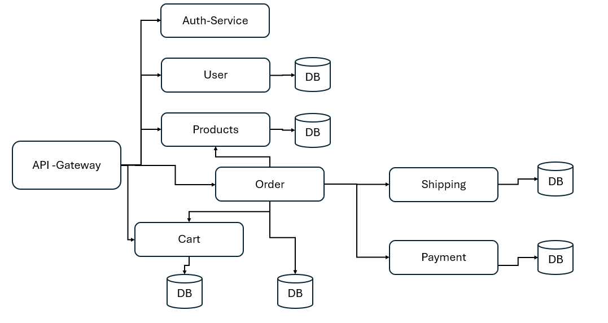

## E-Commerce REST API Server Project  (progessing)

## Introduction
This project is a hands-on microservices workshop where we build a scalable e-commerce backend. I have develope independent services for user management, product catalog, cart, orders, payments, shipping, notifications, authentication, and API gateway. Everything runs in Docker and Kubernetes to simulate a real-world production environment.

## Goals
- Gain confidence in server-side development with Node.js and Express
- Design and implement RESTful APIs
- Secure services with JWT-based authentication and role-based authorization
- Work with MongoDB in a microservice architecture
- Build event-driven communication using Kafka
- Set up monitoring with Prometheus, Alertmanager, and Grafana
- Containerize services and orchestrate them in Kubernetes (Kind)

## user 
- Register, log in, and manage profile
- View product catalog and add personal products
- Add, update, or remove items in the shopping cart
- Checkout cart → creates an order in pending status
- Process payment → pay or refund
- Return products → trigger refund and shipping return flow
- View order history and shipping notifications
- Accept delivered products → mark order completed

## Admin
- Manage (create, update, delete) all products
- View and delete user accounts
- Inspect all orders and payment/refund statuses
- Update shipping records (create shipments, mark delivered/returned)

## Technologies
- Node.js & Express
- MongoDB with Mongoose
- Kafka (via KafkaJS) for event buses
- JWT for authentication & authorization
- Docker & Docker Compose for local development
- Kind (Kubernetes in Docker) for orchestration
- Prometheus, Alertmanager, Grafana for monitoring
- Postman / Insomnia for API testing
- 

##   Service Overview
| Service          | Responsibility |
----------------------------------------------------- 
| auth-service     | JWT issuance and user authentication    | 
| api-gateway      | Centralized reverse-proxy, routing, CORS| 
| user-service     | User account CRUD and admin controls    | 
| product-service  | Product catalog CRUD and owner features | 
| cart-service     | Shopping cart management                | 
| order-service    | Order lifecycle and status updates      | 
| payment-service  | Payment processing and refunds          | 
| shipping-service | Shipment creation, tracking, returns    | 
| notifications    | Email/SMS/Push notifications            | 

## Architecture

## Event-Driven Architecture
Kafka topics coordinate work across services in an asynchronous, decoupled fashion:
   # Product → User / Cart
• ProductCreated, ProductUpdated, ProductRemoved update user’s product lists and cart metadata
   # Cart → Order
• CartCheckout → OrderService creates a pending order
   # Order → Payment & Shipping
• orderCreated → PaymentService creates payment record, ShippingService schedules shipment
   # Payment → Order & Notification
• payment.completed → OrderService marks paid, NotificationService sends confirmation
• payment.refunded → OrderService marks refunded, NotificationService notifies refund
   # Shipping → Order & Notification
• awaiting.shipment, shipment.delivered, shipment.returned → OrderService updates status, NotificationService alerts
   # User Return product
• shipment.returned → triggers refund in PaymentService → emits payment.refunded
   # Order Completion & Inventory
• userAcceptProduct → OrderService marks completed, ProductService decrements stock via decrement.product event

## future goal
- Write unit and integration tests (Jest ,Supertest, Testcontainers)
- Automate CI/CD
- Harden security with network policies, secret management
- Extend features: order analytics, recommendations

-------------------------------------------------
##  Docker Compose simplifies multi-container setups by defining services, 

## Run Everything with One Command
docker-compose up -d
docker-compose -f docker-compose.yml -f docker-compose-metric.yml up --buildc
## To stop:
docker-compose down
docker-compose -f docker-compose.yml -f docker-compose-metric.yml down --volumes --remove-orphans

## Grafana 
http://localhost:4000

## prometheus
http://localhost:9090/targets

## Kubernetes (Kind) Deployment
  kind create cluster --name my-cluster
- kubectl apply -f kubernetes/

